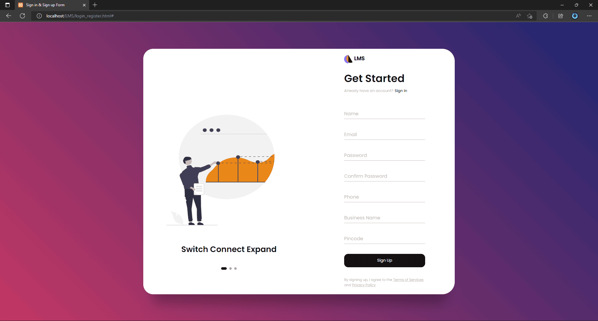
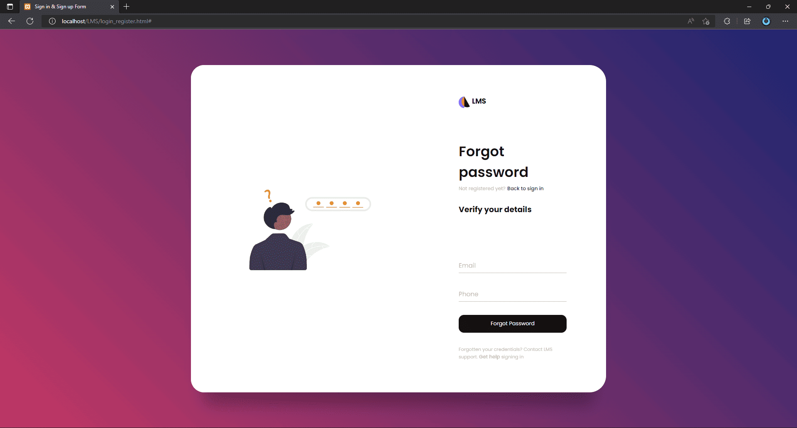
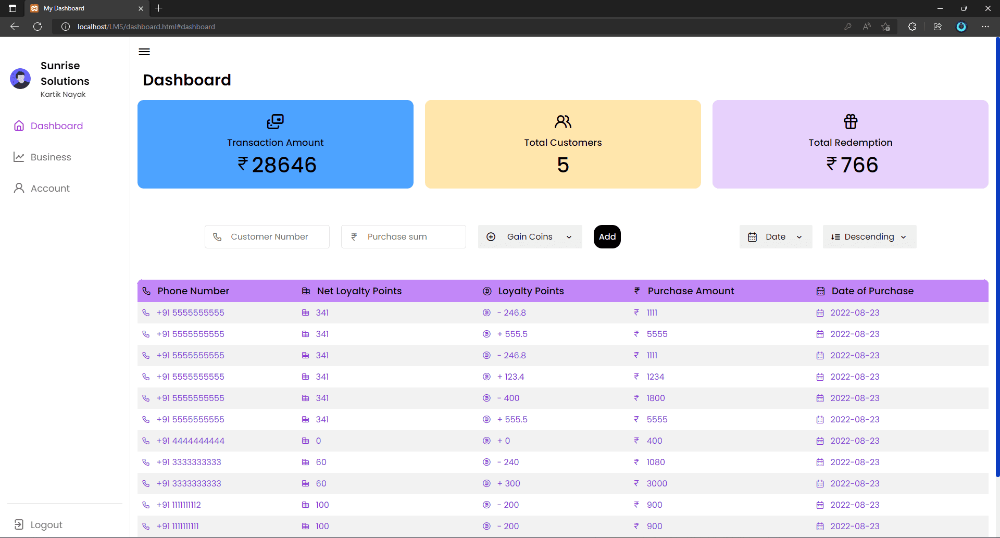
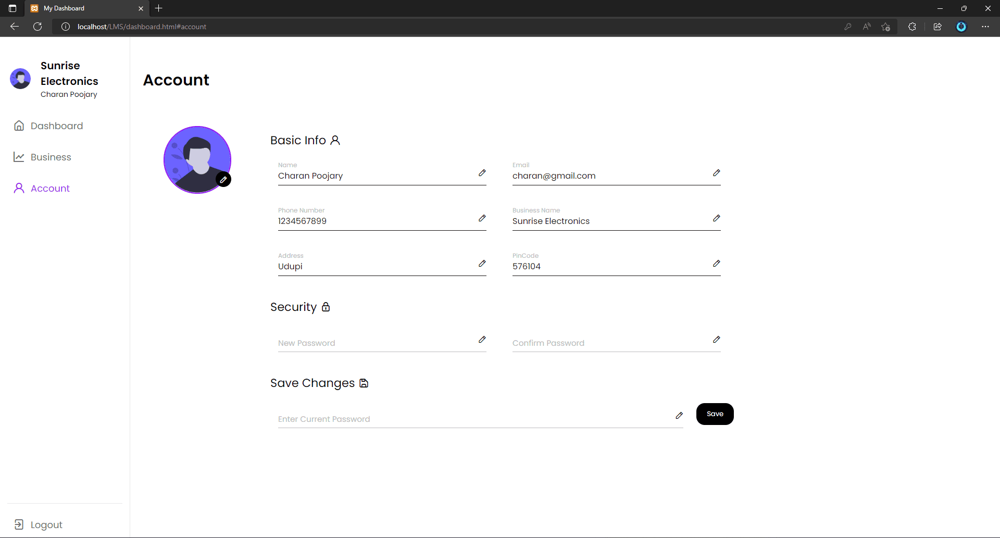

# Loyalty Bridge
Loyalty Bridge is a web-based loyalty management system that enables businesses to track and incentivize customer loyalty. With Loyalty Bridge, customers earn loyalty coins for each purchase, which can then be redeemed for discounts on future purchases.

## Features
* Customer loyalty tracking
* Reward point management
* Discount management
* Web-based interface
* Mobile-friendly design
* Built with HTML, CSS, and JavaScript

## Installation
* Clone the repository to your local machine.
* Run the server application
* Navigate to http://localhost in your web browser.
* Run CT.php in your local server.
* Start the application with index.

## Usage
Once the application is installed and running, businesses can use Loyalty Bridge to track customer loyalty, incentivize repeat business, and manage discount programs. Customers can earn loyalty coins for each purchase, which can then be redeemed for discounts on future purchases.

## Screenshots
 

License
Loyalty Bridge is open source software licensed under the GNU GPL3 License.
